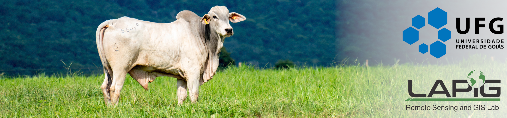

# Pasture Mapping Codes

This repository organizes the pasture mapping codes developed by [Laboratório de Processamento de Imagens e Geoprocessamento (LAPIG/UFG)](https://www.lapig.iesa.ufg.br/). The methology used by LAPIG team is avaliable in the paper of [PARENTE et al. (2019)](https://www.sciencedirect.com/science/article/pii/S0034425719303207) 

**Requisites**:

* Python 3.10 or above
  
* Gdal python package and Gdal Binaries
  
* scipy python package

* joblib python package
  
* Earth Engine python library
  
* An folder synchronization with Google Drive ([For Windows](https://www.google.com/drive/download/) | [For Unix](https://github.com/odeke-em/drive))
  
**Recommendations**: 

The easiest way to execute the post-processing is using [UV](https://docs.astral.sh/uv/getting-started/installation/#installation-methods) Python througth the CLI:

```bash
#1
uv init

#2
uv python install 3.10 

#3
uv add pip scipy joblib earthengine-api

#4
uv run earthengine authenticate

#5 On Windows
uv run pip install https://github.com/cgohlke/geospatial-wheels/releases/download/v2025.1.20/GDAL-3.10.1-cp310-cp310-win_amd64.whl

#5 On Linux
uv run pip install GDAL==3.10

```

# How to use

## 1. Run classification in Google Earth Engine (GEE)

* [Access this link](https://code.earthengine.google.com/f789584eda6ba58ededc0526f0de8da7) and, if desired, change the parameters of ***year***, ***landsatWRSPath_nm***, ***landsatWRSRow_nm***, ***my_folder***. After that you can click in **Run** and export your result in **Task**.

## 2. Prepare the data for Multidimensional Median Filter

Merge the classifications files by year using the binaries **gdalbuildvrt** and **gdal_translate*. E.g.:

* gdalbuildvrt lapig_pasture_map_|year xxxx|.vrt *_|year xxxx|_*.tif
* gdal_translate lapig_pasture_map_|year xxxx|.vrt lapig_pasture_map_|year xxxx|.tif -co COMPRESS=LZW -co BIGTIFF=YES

In addition, if you want to view a file in a GIS like QGIS, just add a pyramid to your data using:

* gdaladdo -ro lapig_pasture_map_<year xxxx>.tif 2 4 8 --config COMPRESS_OVERVIEW LZW --config USE_RRD YES

## 3. Applying the multidimensional median filter (3 x 3 x 5) - ***RUN THIS IF YOU HAVE MORE THAN FIVE YEARS OF CONTINUOUS MAPPING!***

This code need 2 arguments to run, the **<input directory>** and the **<output directory>** (e.g. python 2_Multidimensional_median_filter prob_rasters_dir filtered_rasters_dir).

```shell

python 2_Multidimensional_median_filter_parallel.py <input_dir_name> <output_dir_name>

```

## 4. Merging the files... again.

Like in the section 2, we will use the *gdalbuildvrt* and *gdal_translate* to merge the result files by year.

<details>
<summary> <b>Changelog</b> </summary>
<p>* Version 3.0 released (Github version)</p>
</details>
